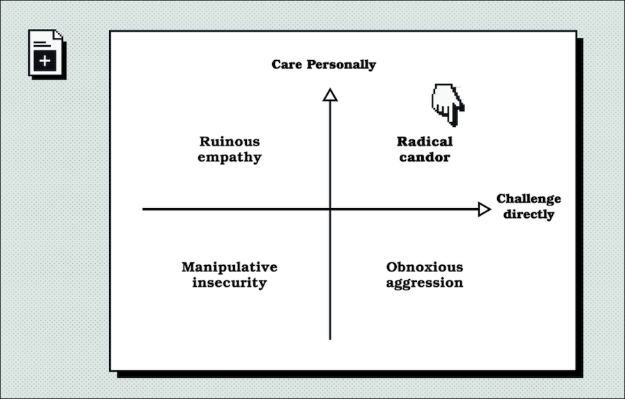

<!--
    description: how to give feedback to your reports and others
    subjects:   communication
-->

# Overview
Feedback is an essential part of being a good manager/leader but executed incorrectly can make you comae across as an uncaring ass! It is important provide feedback in specific ways that help the person recieving it and gives them some actionable goals from recieving it.

When delivering feedback, you need to ensure that you:

 - **Care personally:** about the individual that you’re talking to you. This ensures that you communicate with them because it’s in their best interests and you want to see them improve.
 - **Challenge directly:** to ensure you say exactly what you think. Get to the point, and if you think that something isn’t good enough, say it.

## Radical candor
The idea of radical candor is the perfect balance of giving feedback from a place where you care that the person improves and directly challanging a behaviour that needs it. Getting your delivery of a persons feedback wrong can lead to coming across as outright agressive or even manipulative and insecure

 - **Radical candor:** is what happens when you care personally and challenge directly. You say what you think and deliver the feedback precisely but in such a way that ensures the recipient sees that you are doing so because you care. This is where you want to be. It promotes trust and growth.
- **Ruinous empathy:** happens when you care but don’t challenge directly. It’s either unspecific praise or diluted criticism to avoid a difficult message. This doesn’t help the recipient improve.
- **Obnoxious aggression:** is when you challenge but don’t care. It’s insincere praise or mean criticism.
- **Manipulative insincerity:** is when you do neither. Good behaviors go unpraised, and bad behaviors are ignored.

## Bad traits
Engaging in the bad traits of communication can lead to desent, lack of trust and even impact your ability to successfully achieve your day to day tasks. Unfortunatly communicating well is not easy, as a result we have all fallen fowl of some of the bad traits and probably reguarly see them in our colleagues, these can include:
 - Overcommunication
 - Waffling
 - Playing to the crowd
 - Inconsistency
 - Letting emotion get in the way

 Take time to consider what you are going to say and be aware to try and avoid the above. If you are struggling look into ways to target each one in turn and try and address